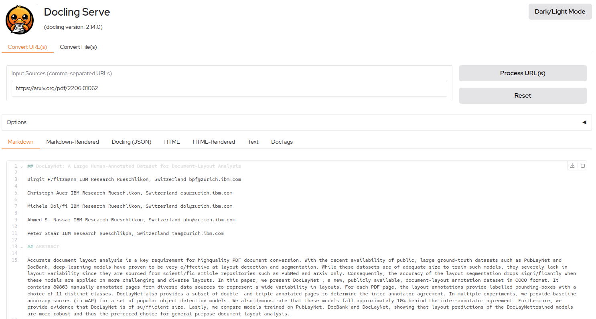

# Docling Serve

 Running [Docling](https://github.com/DS4SD/docling) as an API service.

## Usage

The API provides two endpoints: one for urls, one for files. This is necessary to send files directly in binary format instead of base64-encoded strings.

### Common parameters

On top of the source of file (see below), both endpoints support the same parameters, which are almost the same as the Docling CLI.

- `from_format` (List[str]): Input format(s) to convert from. Allowed values: `docx`, `pptx`, `html`, `image`, `pdf`, `asciidoc`, `md`. Defaults to all formats.
- `to_formats` (List[str]): Output format(s) to convert to. Allowed values: `md`, `json`, `html`, `text`, `doctags`. Defaults to `md`.
- `do_ocr` (bool): If enabled, the bitmap content will be processed using OCR. Defaults to `True`.
- `image_export_mode`: Image export mode for the document (only in case of JSON, Markdown or HTML). Allowed values: embedded, placeholder, referenced. Optional, defaults to `embedded`.
- `force_ocr` (bool): If enabled, replace any existing text with OCR-generated text over the full content. Defaults to `False`.
- `ocr_engine` (str): OCR engine to use. Allowed values: `easyocr`, `tesseract_cli`, `tesseract`, `rapidocr`, `ocrmac`. Defaults to `easyocr`.
- `ocr_lang` (List[str]): List of languages used by the OCR engine. Note that each OCR engine has different values for the language names. Defaults to empty.
- `pdf_backend` (str): PDF backend to use. Allowed values: `pypdfium2`, `dlparse_v1`, `dlparse_v2`. Defaults to `dlparse_v2`.
- `table_mode` (str): Table mode to use. Allowed values: `fast`, `accurate`. Defaults to `fast`.
- `abort_on_error` (bool): If enabled, abort on error. Defaults to false.
- `return_as_file` (boo): If enabled, return the output as a file. Defaults to false.
- `do_table_structure` (bool): If enabled, the table structure will be extracted. Defaults to true.
- `include_images` (bool): If enabled, images will be extracted from the document. Defaults to true.
- `images_scale` (float): Scale factor for images. Defaults to 2.0.

### URL endpoint

The endpoint is `/v1alpha/convert/source`, listening for POST requests of JSON payloads.

On top of the above parameters, you must send the URL(s) of the document you want process with either the `http_sources` or `file_sources` fields.
The first is fetching URL(s) (optionally using with extra headers), the second allows to provide documents as base64-encoded strings.
No `options` is required, they can be partially or completely omitted.

Simple payload example:

```json
{
  "http_sources": [{"url": "https://arxiv.org/pdf/2206.01062"}]
}
```

<details>

<summary>Complete payload example:</summary>

```json
{
  "options": {
    "from_formats": ["docx", "pptx", "html", "image", "pdf", "asciidoc", "md", "xlsx"],
    "to_formats": ["md", "json", "html", "text", "doctags"],
    "image_export_mode": "placeholder",
    "do_ocr": true,
    "force_ocr": false,
    "ocr_engine": "easyocr",
    "ocr_lang": ["en"],
    "pdf_backend": "dlparse_v2",
    "table_mode": "fast",
    "abort_on_error": false,
    "return_as_file": false,
  },
  "http_sources": [{"url": "https://arxiv.org/pdf/2206.01062"}]
}
```

</details>

<details>

<summary>CURL example:</summary>

```sh
curl -X 'POST' \
  'http://localhost:5001/v1alpha/convert/source' \
  -H 'accept: application/json' \
  -H 'Content-Type: application/json' \
  -d '{
  "options": {
    "from_formats": [
      "docx",
      "pptx",
      "html",
      "image",
      "pdf",
      "asciidoc",
      "md",
      "xlsx"
    ],
    "to_formats": ["md", "json", "html", "text", "doctags"],
    "image_export_mode": "placeholder",
    "do_ocr": true,
    "force_ocr": false,
    "ocr_engine": "easyocr",
    "ocr_lang": [
      "fr",
      "de",
      "es",
      "en"
    ],
    "pdf_backend": "dlparse_v2",
    "table_mode": "fast",
    "abort_on_error": false,
    "return_as_file": false,
    "do_table_structure": true,
    "include_images": true,
    "images_scale": 2,
  },
  "http_sources": [{"url": "https://arxiv.org/pdf/2206.01062"}]
}'
```

</details>

<details>
<summary>Python example:</summary>

```python
import httpx

async_client = httpx.AsyncClient(timeout=60.0)
url = "http://localhost:5001/v1alpha/convert/source"
payload = {
  "options": {
    "from_formats": ["docx", "pptx", "html", "image", "pdf", "asciidoc", "md", "xlsx"],
    "to_formats": ["md", "json", "html", "text", "doctags"],
    "image_export_mode": "placeholder",
    "do_ocr": True,
    "force_ocr": False,
    "ocr_engine": "easyocr",
    "ocr_lang": "en",
    "pdf_backend": "dlparse_v2",
    "table_mode": "fast",
    "abort_on_error": False,
    "return_as_file": False,
  },
  "http_sources": [{"url": "https://arxiv.org/pdf/2206.01062"}]
}

response = await async_client_client.post(url, json=payload)

data = response.json()
```

</details>

#### File as base64

The `file_sources` argument in the endpoint allows to send files as base64-encoded strings.
When your PDF or other file type is too large, encoding it and passing it inline to curl
can lead to an “Argument list too long” error on some systems. To avoid this, we write
the JSON request body to a file and have curl read from that file.

<details>
<summary>CURL steps:</summary>

```sh
# 1. Base64-encode the file
B64_DATA=$(base64 -w 0 /path/to/file/pdf-to-convert.pdf)

# 2. Build the JSON with your options
cat <<EOF > /tmp/request_body.json
{
  "options": {
  },
  "file_sources": [{
    "base64_string": "${B64_DATA}",
    "filename": "pdf-to-convert.pdf"
  }]
}
EOF

# 3. POST the request to the docling service
curl -X POST "localhost:5001/v1alpha/convert/source" \
     -H "Content-Type: application/json" \
     -d @/tmp/request_body.json
```

</details>

### File endpoint

The endpoint is: `/v1alpha/convert/file`, listening for POST requests of Form payloads (necessary as the files are sent as multipart/form data). You can send one or multiple files.

<details>
<summary>CURL example:</summary>

```sh
curl -X 'POST' \
  'http://127.0.0.1:5001/v1alpha/convert/file' \
  -H 'accept: application/json' \
  -H 'Content-Type: multipart/form-data' \
  -F 'ocr_engine=easyocr' \
  -F 'pdf_backend=dlparse_v2' \
  -F 'from_formats=pdf' \
  -F 'from_formats=docx' \
  -F 'force_ocr=false' \
  -F 'image_export_mode=embedded' \
  -F 'ocr_lang=en' \
  -F 'ocr_lang=pl' \
  -F 'table_mode=fast' \
  -F 'files=@2206.01062v1.pdf;type=application/pdf' \
  -F 'abort_on_error=false' \
  -F 'to_formats=md' \
  -F 'to_formats=text' \
  -F 'return_as_file=false' \
  -F 'do_ocr=true'
```

</details>

<details>
<summary>Python example:</summary>

```python
import httpx

async_client = httpx.AsyncClient(timeout=60.0)
url = "http://localhost:5001/v1alpha/convert/file"
parameters = {
"from_formats": ["docx", "pptx", "html", "image", "pdf", "asciidoc", "md", "xlsx"],
"to_formats": ["md", "json", "html", "text", "doctags"],
"image_export_mode": "placeholder",
"do_ocr": True,
"force_ocr": False,
"ocr_engine": "easyocr",
"ocr_lang": ["en"],
"pdf_backend": "dlparse_v2",
"table_mode": "fast",
"abort_on_error": False,
"return_as_file": False
}

current_dir = os.path.dirname(__file__)
file_path = os.path.join(current_dir, '2206.01062v1.pdf')

files = {
    'files': ('2206.01062v1.pdf', open(file_path, 'rb'), 'application/pdf'),
}

response = await async_client.post(url, files=files, data={"parameters": json.dumps(parameters)})
assert response.status_code == 200, "Response should be 200 OK"

data = response.json()
```

</details>

### Response format

The response can be a JSON Document or a File.

- If you process only one file, the response will be a JSON document with the following format:

  ```jsonc
  {
    "document": {
      "md_content": "",
      "json_content": {},
      "html_content": "",
      "text_content": "",
      "doctags_content": ""
      },
    "status": "<success|partial_success|skipped|failure>",
    "processing_time": 0.0,
    "timings": {},
    "errors": []
  }
  ```

  Depending on the value you set in `output_formats`, the different items will be populated with their respective results or empty.

  `processing_time` is the Docling processing time in seconds, and `timings` (when enabled in the backend) provides the detailed
  timing of all the internal Docling components.

- If you set the parameter `return_as_file` to True, the response will be a zip file.
- If multiple files are generated (multiple inputs, or one input but multiple outputs with `return_as_file` True), the response will be a zip file.

## Helpers

- A full Swagger UI is available at the `/docs` endpoint.


- An easy to use UI is available at the `/ui` endpoint.




## Development

### CPU only

```sh
# Install poetry if not already available
curl -sSL https://install.python-poetry.org | python3 -

# Install dependencies
poetry install --with cpu
```

### Cuda GPU

For GPU support use the following command:

```sh
# Install dependencies
poetry install
```

### Run the server

The [start_server.sh](./start_server.sh) executable is a convenient script for launching the local webserver.

```sh
# Run the server
bash start_server.sh

# Run the server with live reload
RELOAD=true bash start_server.sh
```

### Environment variables

The following variables are available:

- `DOCLING_ARTIFACTS_PATH`: if set Docling will use only the local weights of models, for example `/opt/app-root/.cache/docling/cache`.
- `TESSDATA_PREFIX`: Tesseract data location, example `/usr/share/tesseract/tessdata/`.
- `UVICORN_WORKERS`: Number of workers to use.
- `RELOAD`: If `True`, this will enable auto-reload when you modify files, useful for development.
- `WITH_UI`: If `True`, The Gradio UI will be available at `/ui`.

## Get help and support

Please feel free to connect with us using the [discussion section](https://github.com/DS4SD/docling/discussions).

## Contributing

Please read [Contributing to Docling Serve](https://github.com/DS4SD/docling-serve/blob/main/CONTRIBUTING.md) for details.

## References

If you use Docling in your projects, please consider citing the following:

```bib
@techreport{Docling,
  author = {Deep Search Team},
  month = {8},
  title = {Docling Technical Report},
  url = {https://arxiv.org/abs/2408.09869},
  eprint = {2408.09869},
  doi = {10.48550/arXiv.2408.09869},
  version = {1.0.0},
  year = {2024}
}
```

## License

The Docling Serve codebase is under MIT license.

## IBM ❤️ Open Source AI

Docling has been brought to you by IBM.
